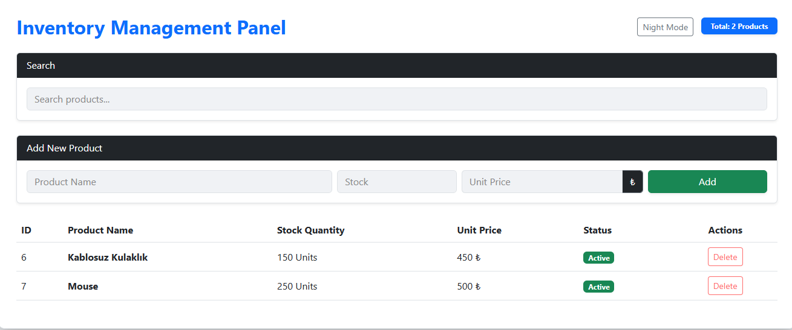
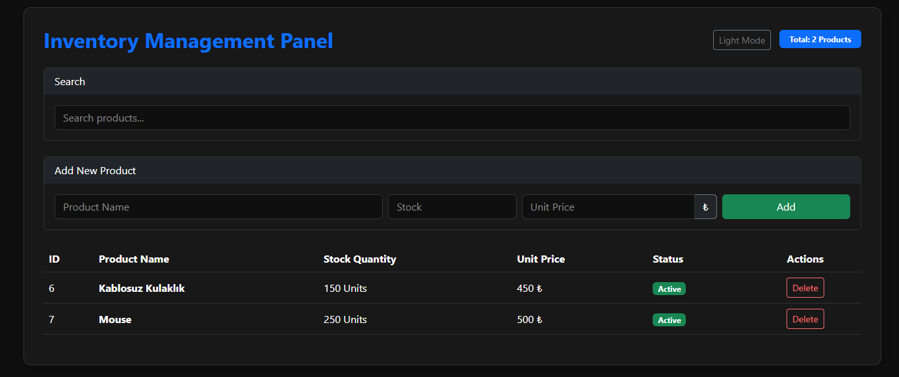
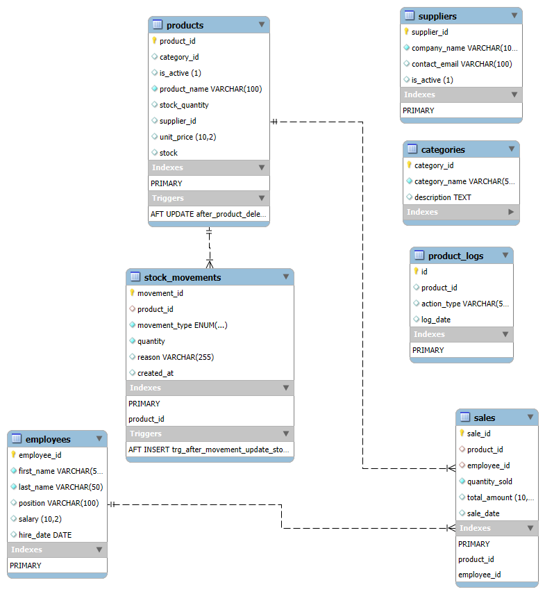

# Inventory Management System

## Project Summary
This is a full-stack web application developed to manage product inventory. The system features a responsive dashboard with dark and light mode support, automated data logging using MySQL triggers, and a robust backend built with Spring Boot. It is designed to demonstrate core engineering concepts like data integrity, soft-deletion, and relational database management.

## Technologies Used
* Backend: Java 17, Spring Boot, Spring Data JPA
* Database: MySQL 8.0 (Triggers, Stored Procedures, ER Modeling)
* Frontend: JavaScript (Fetch API), HTML5, CSS3, Bootstrap 5
* Build Tool: Maven
* Version Control: Git

## Screenshots

### Light Mode Interface

### Dark Mode Interface

### Database ER Diagram

## Installation and Setup

1. Clone the Repository
git clone https://github.com/ozturk-zeynep/inventory-management.git

2. Database Configuration
* Create a MySQL database named erp_db.
* Import the database.sql file from the /MySQL folder to initialize tables, triggers, and procedures.

3. Backend Configuration
* Navigate to src/main/resources/application.properties.
* Update the spring.datasource.username and spring.datasource.password with your local MySQL credentials.

4. Running the Application
* Execute the command: ./mvnw spring-boot:run
* Access the application at: http://localhost:8080
